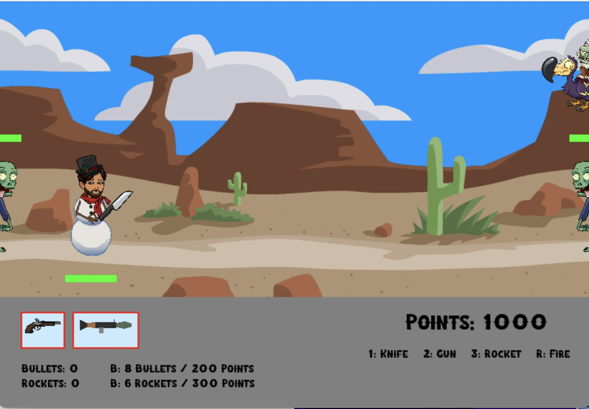

# Zombie-Game
Third-person shooting game using Pygame

Game starts with a loading screen and asks the user to tap anywhere to start the game.

The player starts with a Knife and 0 points. The user can move using WASD keys and eliminate zombies using the 'R' key to earn points.

Once the player accumulates enough points, they can purchase a pistol or a rocket launcher to eliminate zombies from a distance. The weapons have limited ammo, more ammo can be purchased with points using the 'B' key.

Look out for special flying zombies that give extra points!

Once the game is over, it displayes how many zombies the player eliminated and what the current score was.

# How to Play

1. Clone the repository
2. Install the requirements (Pygame)
3. Run main.py
